# llm-router

[](https://pypi.org/project/llm-dispatch/)
[](LICENSE)
[](https://github.com/iamadhitya1)


> Route prompts to the right LLM automatically by complexity. Supports Groq, OpenAI, and Anthropic. Cut costs without cutting quality.

Stop hardcoding a single model. `llm-router` scores your prompt's complexity and routes it to the cheapest model that can handle it.

Simple prompts → fast cheap models. Complex prompts → powerful models. Automatically.

<div align="center">
  
</div>

---

> **Package name note:** this repo is `llm-router` but the PyPI package is **`llm-dispatch`**.
> ```bash
> pip install llm-dispatch   # ← correct
> pip install llm-router     # ← does NOT exist on PyPI
> ```
> The import is `from llmrouter import LLMRouter`.

---

## When to use this

Use `llm-router` when:
- You're making **many LLM calls with varying complexity** and want to minimize cost automatically
- You want to **run simple queries on cheap/fast models** (Groq Llama 8b) and only escalate to GPT-4o or Claude Sonnet when the prompt actually needs it
- You support **multiple providers** (Groq + OpenAI + Anthropic) and want a single interface
- You want **per-call cost estimates** logged alongside responses

Not the right fit if you need agents, tool calling, or function execution — this is a routing layer for text completion, not an agent framework.

---

## Why not LiteLLM?

LiteLLM is a unified API layer — it lets you call any model with the same interface, but you still decide which model to use. `llm-router` decides for you based on prompt complexity. The two tools are complementary, not competing: use LiteLLM if you want provider unification with manual model selection; use `llm-router` if you want the model selection to be automatic and cost-aware.

---

## Install

```bash
pip install llm-dispatch

# Install provider SDKs you need:
pip install llm-dispatch[groq]       # Groq only
pip install llm-dispatch[openai]     # OpenAI only
pip install llm-dispatch[anthropic]  # Anthropic only
pip install llm-dispatch[all]        # All providers
```

---

## Quick Start

```python
from llmrouter import LLMRouter

router = (
    LLMRouter(verbose=True)
    .add("groq/llama-3.1-8b-instant")    # fast, cheap
    .add("groq/llama-3.3-70b-versatile") # powerful
    .add("openai/gpt-4o")                # best quality
)

# Simple prompt → routed to cheap fast model
result = router.complete("What is the capital of France?")
print(result.output)      # Paris
print(result.model_used)  # llama-3.1-8b-instant
print(result.estimated_cost_usd)  # 0.000001

# Complex prompt → routed to powerful model
result = router.complete("""
    Analyze the architectural trade-offs between microservices and
    monolithic systems for a high-traffic fintech application.
    Consider scalability, fault tolerance, and deployment complexity.
""")
print(result.model_used)  # gpt-4o
```

---

## Strategies

```python
# Auto (default) — complexity-aware routing
router = LLMRouter(strategy="auto")

# Always cheapest model that fits the context window
router = LLMRouter(strategy="cheapest")

# Always fastest model
router = LLMRouter(strategy="fastest")

# Always highest quality model
router = LLMRouter(strategy="smartest")

# Balance speed and quality
router = LLMRouter(strategy="balanced")

# Override per call
result = router.complete(prompt, strategy="cheapest")
```

---

## How auto-routing works

The router scores each prompt from `0.0` (trivial) to `1.0` (very complex):

| Complexity | Score | Routed to |
|------------|-------|-----------|
| Simple question | < 0.25 | Cheapest fast model |
| Medium task | 0.25–0.60 | Best quality/cost ratio |
| Complex analysis | > 0.60 | Highest quality model |

**Scoring factors:** prompt length, technical keywords, code blocks, number of questions, multi-part instructions.

```python
from llmrouter import complexity_score

complexity_score("What is 2+2?")                         # 0.0
complexity_score("Summarize this 500-word article")      # 0.35
complexity_score("Refactor this Python class and add type hints and unit tests") # 0.72
```

---

## Available Models

```python
from llmrouter import PRESET_MODELS
print(list(PRESET_MODELS.keys()))
```

| Model ID | Provider | Speed | Quality | Cost/1k tokens |
|----------|----------|-------|---------|---------------|
| `groq/llama-3.1-8b-instant` | Groq | fast | 4/10 | $0.00005 |
| `groq/llama-3.3-70b-versatile` | Groq | medium | 8/10 | $0.00059 |
| `groq/mixtral-8x7b-32768` | Groq | medium | 7/10 | $0.00024 |
| `openai/gpt-4o-mini` | OpenAI | fast | 6/10 | $0.00015 |
| `openai/gpt-4o` | OpenAI | medium | 9/10 | $0.005 |
| `anthropic/claude-haiku-3` | Anthropic | fast | 6/10 | $0.00025 |
| `anthropic/claude-sonnet-4` | Anthropic | medium | 9/10 | $0.003 |

---

## Custom Models

```python
from llmrouter import LLMRouter, ModelConfig

router = LLMRouter()
router.add_custom(ModelConfig(
    model_id="my-provider/my-model",
    provider="groq",           # uses Groq's SDK
    name="my-model-name",
    cost_per_1k=0.0001,
    context_window=16384,
    speed="fast",
    quality=5,
))
```

---

## RouteResult

Every `.complete()` call returns a `RouteResult`:

```python
result.output               # str — model response
result.model_used           # str — model name selected
result.provider             # str — 'groq' | 'openai' | 'anthropic'
result.complexity_score     # float 0.0–1.0
result.strategy             # str — strategy used
result.estimated_cost_usd   # float — estimated cost in USD
```

---

## Environment Variables

```bash
GROQ_API_KEY=gsk_...
OPENAI_API_KEY=sk-...
ANTHROPIC_API_KEY=sk-ant-...
```

Or pass per model:
```python
router.add("groq/llama-3.3-70b-versatile", api_key="gsk_...")
```

---

## Author

**[M. Adhitya](https://iamadhitya.vercel.app)** — Builder, [Rewrite Labs](https://rewritelabs.vercel.app) · [Newsletter](https://adhitya.beehiiv.com/)

## License

MIT © 2025 [M. Adhitya](https://iamadhitya.vercel.app)

Built at [Rewrite Labs](https://rewritelabs.vercel.app)
